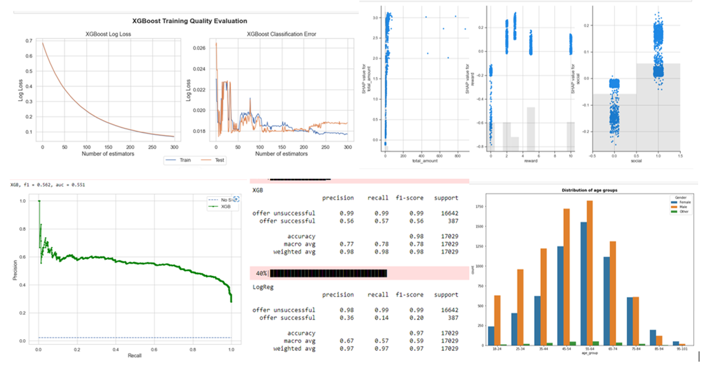

The results of this analysis were selected for publication at the Startup-Medium [here](https://paul-dzitse.medium.com/)

## Table of Contents
<li><a href="#intro">1.	Project Overview
<li><a href="#dataoverview">2. Dataset Overview
<li><a href="#description">3. Steps
<li><a href="#results">4. Important Folders and Files
<li><a href="#features">5.  Dependencies 
<li><a href="#graphical">6. Graphical Abstract  
<li><a href="#acknowledge">7. Acknowledgement
  

## 1. Project Overview

The Starbucks Udacity Data Scientist Nanodegree Capstone challenge data set is a simulation of customer behaviour on the Starbucks rewards mobile application. Periodically, Starbucks sends offers to users that may be an advertisement, discount, or buy one get on free (BOGO). An important characteristic regarding this dataset is that not all users receive the same offer.
This data set contains three files. The first file describes the characteristics of each offer, including its duration and the amount a customer needs to spend to complete it (difficulty). 
  
The second file contains customer demographic data including their age, gender, income, and when they created an account on the Starbucks rewards mobile application.
  
The third file describes customer purchases and when they received, viewed, and completed an offer. An offer is only successful when a customer both views an offer and meets or exceeds its difficulty within the offer's duration.
  

## 2. Dataset Overview 
  
  
The data is contained in three files:
-	portfolio.json - containing offer ids and meta data about each offer (duration, type, etc.)
-	profile.json - demographic data for each customer
-	transcript.json - records for transactions, offers received, offers viewed, and offers completed
  
Here is the schema and explanation of each variable in the files:
portfolio.json
-	id (string) - offer id
-	offer_type (string) - type of offer ie BOGO, discount, informational
-	difficulty (int) - minimum required spend to complete an offer
-	reward (int) - reward given for completing an offer
-	duration (int) - time for offer to be open, in days
-	channels (list of strings)
  
profile.json
-	age (int) - age of the customer
-	became_member_on (int) - date when customer created an app account
-	gender (str) - gender of the customer (note some entries contain 'O' for other rather than M or F)
-	id (str) - customer id
-	income (float) - customer's income
  
transcript.json
-	event (str) - record description (ie transaction, offer received, offer viewed, etc.)
-	person (str) - customer id
-	time (int) - time in hours since start of test. The data begins at time t=0
-	value - (dict of strings) - either an offer id or transaction amount depending on the record
  

## 3. Steps

1. Access, Clean and Analyse Data
  
   To begin, I access, clean and analyse the three datasets to get an understanding of their structures. Data ranges from 2013 to 2018.
  
2. Data Visualisation 
  
   Then i visualize the data to understand relationship between the variables.
  
3. Data Construction
  
   After i construct a clean data (all users that received an offers and view them) for the analysis by combining four datasets, **portfolio**, **profile**, **transaction** and **offer data**.  The New dataset is unbalanced, so I treated it as binary classification problem, with **majority class: offer unsuccessful (0)** and **minority class: offer successful (1)**. I put focus on analysing the minority class.
   
 4. Models Selection and Fine Tunning 
  
    These models were initially selected, trained, tested and evaluation conducted based on **threshold**, **ranking** and **probability** metrics, in addition to using **bootstrap resampling** methods.
  
    -	Logistic Regression
    -	Random Forest: ensemble bagging classifier
    -	K-Nearest Neighbours: instance based classifier
    -	Gaussian Naive Bayes: probabilistic classifier
    -	XGBoost: ensemble (extreme!) boosting classifier
  
     I select XGBoost the final analysis.  Its parameters are fine-tuned by using Grid Search algorithm. Evaluation metrics like **precision**, **recall**, **f1-score**, **log loss** and **classification error** improved against initial scores. 

5. Features importance 
  
    First the model is created with the optimal parameters, then passed into **SHAP Explainer function** to create an explainer objects and then use to calculate the SHAP values for each observation. SHAP values are used to explain the predictions of a model.
  
 
 ## 4. Important Folders and Files
    
   The project directory takes this form:
  - data
    - profile.json  (json-file having data on all articles available to all users)
    - portfolo.json (json-file having data on portfolios on offer types)
    - transcript.json (json-file having data on transaction and offer received, viewed and completed)
  - image
    - abstracts.png
 - Readme.md
 - LINCENSE
 - starbucks-reward_mobile_app_users.ipynb (Main Jupyter notebook for the project)
 - starbucks-reward_mobile_app_users.html (HTML version of the main Jupyter notebook)
 

## 6. To start    
### Dependencies
 
 - [Pandas](https://pandas.pydata.org/)
 - [Plotly](https://plotly.com/python/)
 - [Progressbar](https://tqdm.github.io/)
 - [Numpy](https://numpy.org/)
 - [Seaborn](https://seaborn.pydata.org/)
 - [Sklearn](https://scikit-learn.org/stable/)
 
  
  ## 7. Graphical Abstracts
  
  Some of graphical abstracts can be seen below.
   
  

## 8. Acknowledgement
  
Credit must be given to [Stackbruck](https://www.starbucks.com/) for the dataset also to [Udacity](https://www.udacity.com/school-of-data-science) for Data Scientist Nanodegree program. Otherwise feel free to use this code as you would like.
